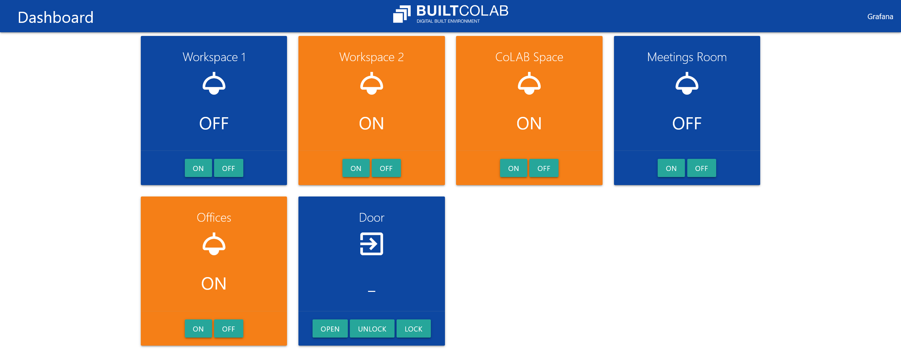

# mqttdash

A simple codegen tool for developing single-page dashboards using MQTT-over-Websockets.

It uses [mustache](https://mustache.github.io/) to generate a static web page according to the [templates/index.mustache](templates/index.mustache) template.

Communication happens using MQTT-over-Websockets, and the `retained` messages are leveraged as a topic-based state datastore.

## How to run

### Run with Docker

```
$ docker build -t mqttdash .
$ docker run -p 8080:8080 mqttdash
```

`mqttdash` is now availabe at port 8080.

### Run locally

```
$ npm install
$ npm run build
$ npm run serve
```

A `public` folder is generated and served as a static page.

### Run as dev environment

```
$ npm install
$ npm run dev
```

You can also just build the HTML once (without auto generation on save):

```
$ npm install
$ npm run build
```

A `public` folder is generated.

## How to use the `config.json` file

### Global configs

- `title`: the page title / name;
- `favicon`: an URL for the site favicon;
- `logo`: an URL for the logo for the top navbar;

### Extra links

An array of objects containing external links to appear as part of the site navbar. Each object of the array has:

- `name`: name to be rendered;
- `icon`: a related icon from the [material icons font](https://fonts.google.com/icons?selected=Material+Icons);
- `url`: the URL for the external website (it opens as a new tab/window).

### Categories

An array of objects that contains information about the categories of _devices_. It is used to generated the navigation tabs. Each object of the array has:

- `name`: the friendly name to appear in the tab;
- `category`: the real category name to be used to categorize the different _devices_;
- `icon`: a related icon from the [material icons font](https://fonts.google.com/icons?selected=Material+Icons);
- `default`: the default tab to open when the page renders (the value of the key is ingored, only its existence is checked). Only one object in the array can have the key.

### Devices

An array of objects that contains information about the MQTT _devices_. Each _device_ is render in the web view in accordance to the existence or not of certain properties in the object. A device object consists of:

- `name` (mandatory): a descriptive name for the device;
- `icon`: a related icon from the [material icons font](https://fonts.google.com/icons?selected=Material+Icons);
- `category`: the device category according to the [categories array](#categories). Defaults to _all_ if no category key is provided;
- `topic` (mandatory): MQTT topic corresponding to the value that should be rendered in the webview (only strings and numbers are supported, and are directly printed as they come in the payload);
- `actions`: an array that maps the possible device states and actions (if they exist). If no action is provided, the _device_ falls back to the default color and only presents the values as they come from MQTT;

Each `action` object has:

- `message`: the message payload that corresponds to the payload to be sent if an `actionTopic` is provided. It is also used to change the color of the _device_ in accordance to the last message recieved in the _device_ `topic`;
- `actionTopic`: if defined, renders a button on the web interface that publishes to the MQTT `actionTopic` the corresponding `message`;
- `retained`: if the message should be retained or not in the MQTT broker;
- `color`: the color correponding to the specific `message`. The card color changes accordingly. The color must be one of the following: `grey`, `indigo`, `blue`, `blue-grey`, `yellow`, `green`, `red`, `purple`, and `orange` (new colors or change defaults can be done by modifying the [style.css](style.css) file).

## Web Interface Example


