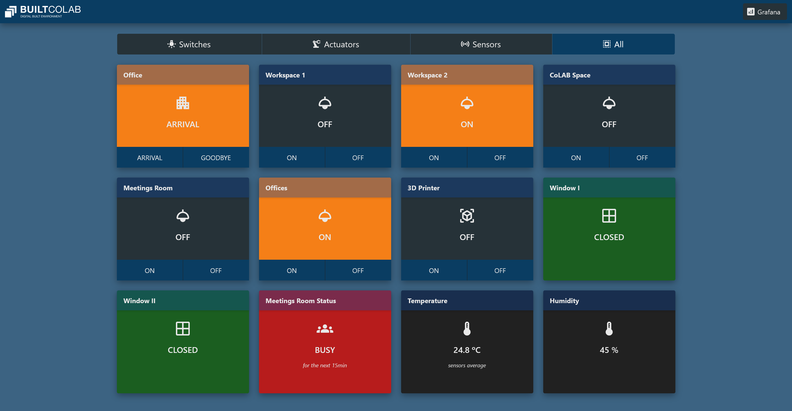

# mqttdash

A simple codegen tool for developing single-page dashboards using MQTT-over-Websockets.

It uses [mustache](https://mustache.github.io/) to generate a static web page according to the [templates/index.mustache](templates/index.mustache) template.

Communication happens using MQTT-over-Websockets, and the `retained` messages are leveraged as a topic-based state datastore.

## How to run

```
$ npm install
$ npm run build
$ npm run serve
```

A `public` folder is generated and served as a static page.

## How to run as dev environment

```
$ npm install
$ npm run dev
```

You can also just build the HTML once (without auto generation on save):

```
$ npm install
$ npm run build
```

A `public` folder is generated.

## Example


